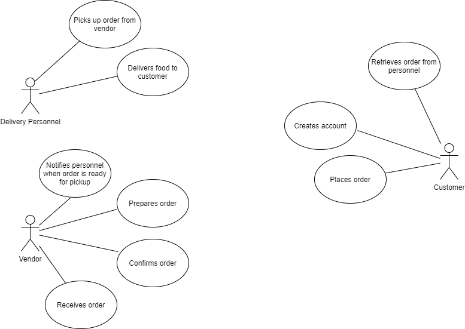
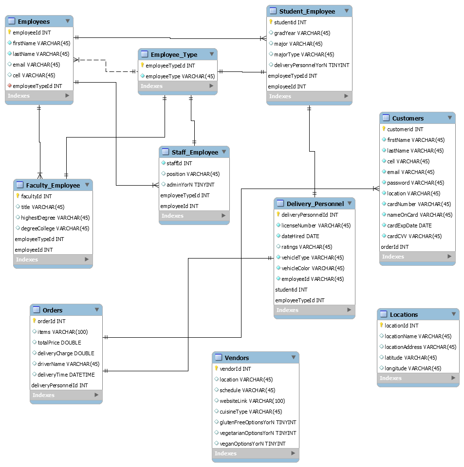
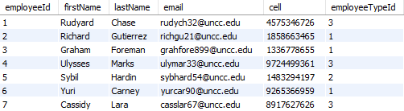

# ITCS3160_Project1
By Niara Parker

## TOC Outline:
[Introduction](#i-introduction)

[Use Case](#ii-use-case)

[Business Rules](#iii-business-rules)

[EERD](#iv-eerd)

[Data Dictionary](#v-data-dictionary)

[MySQL Queries](#vi-mysql-queries)

[Trigger](#vii-trigger)

[Stored Procedure](#viii-stored-procedure)

[Web/App Implementation (Optional) or Description of Future Work](#ix-web/app-inplementation-(optional)-or-description-of-future-work)

[MySQL dump](#x-mysql-dumb)

### I. Introduction

Food delivery services are becoming very popular on campus, however, the steady flow of visitors that deliver the food to students is something that is concerning due to the threat of security on campus. To resolve this problem, many campuses are utilizing food services where it is 100% employed by the students that attend their school. With this new delivery service, the goal of this project is to create a database that keeps track of everything regarding the delivery service and to guarantee that it remains a campus controlled service where know outsiders intrude.

### II. Use Case

As demonstrated in the image below, the use case shows how the customer creates account to fill out information in order to proceed with the app. Accordingly, the customer will place an order for the following food vendor that they wish to order from. Once that order is placed, the food vendor will receive the order and send an order confirmation to the customer. Once the order confirmation is sent, the vendor will prepare the order. After the vendor finishes preparing the order and will then notify a delivery personnel who is nearby that the order is ready for pickup. The delivery personnel will the pick up the order from the vendor and then deliver it to the customer to a destinated location. Lastly, the customer will retreive their order from the delivery personnel.

### III. Business Rules

#### A. Employees

Employees must have accounts in the university system which includes their personid, name, email, cell, and other important information. Depending on the type of employee, rather a faculty, staff, or student, we will include specific information pertaining to them. These are the only groups that are included.

##### Faculty

For employees who are faculty members of the university, we will make sure to include their title, highest degree, and degreecollege.

##### Staff

For employees who are staff members of the university, we will make sure to include their Position and AdminYorN.

##### Students

For employees who are students of the university, we will make sure to include their GradYear, major, and type of major (undergraduate or graduate).

#### B. Deliverable Locations

The campus will have approved locations which are spots where the food can be delivered too. This will include dorms, the student center, and approved classroom buildings. To keep track of the locations we will include LocationID, LocationName, LocationAddress, Latitude and Longitude. In addition, a food delivery drop-off point is included which is a designated place for meeting or delivering the food.

#### C. Delivery Personnel

Employees can be drivers where they can become delivery personnel which are approved. With the driver personnel we will include their licensenumber, datehired, and ratings. In addition, we will include additonal vehicle information. Lastly, all delivery personnel will be students.

#### D. Orders

For each delivery, there will be a flat fee of $5. A person will order food one to many times. Each individual delivery will be tied to one and only one person for the order. An order is not allowed to come from multiple restaurants and may only come from one restaurant. In terms of the items on the order, we will only need to keep record of the total price, delivery charge, the driver, and the delivery times. There also will be a unique identifier that ties the ID for the order at the restaurant. For the actual items on the order they will come from the restaurant database so we will not be responsible for that.

#### E. Vendors

Vendors will include any food providers or restaurants who must be approved in order to be included in the database. For the vendors we will include an ID, location, schedule, and a link to the website along with any additional attributes.

#### F. Health and Wellness of Campus Community

This database will also serve as a source for providing valuabe information about nutrition and eating habits of the campus community and will be able to cater to the varying diets of our students by specifying vegetarian, vegan, gluten free, and many more options.

### IV. EERD

### V. Data Dictionary

### VI. MySQL Queries (three)

### VII. Trigger

### VIII. Stored Procedure

### IX. Web/App Implementation (Optional) or Description of Future Work

### X. MySQL dump

This is a dumb of the UNCC Delivery schema that displays all the tables.

#### Customers Table

This is the [customers table dump file](uncc_delivery_customers.sql). Below is an image that displays part of the populated customers table:

As shown by the image above, the table consists of important information pertaining to the customer which includes their first and last name, password, credit card information, and a customer ID .

#### Employees Table

This is the [employees table dump file](uncc_delivery_employees.sql). Below is an image that displays part of the populated employees table:

In the image above, it contains information regarding all the employees for the UNCC Food Delivery. This information includes an employeeId, first and last name, email, phone number, and the employee type (Faculty, Staff, or Student).

#### Employee Type Table

#### Faculty Employee Table

#### Staff Employee Table

#### Student Employee Table

#### Delivery Personnel Table

#### Locations Table

#### Vendors Table

#### Orders Table

