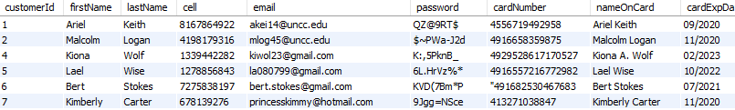
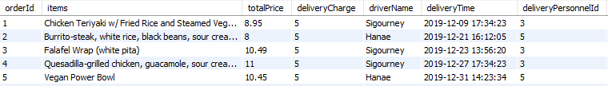

# ITCS3160_Project1
By Niara Parker

## TOC Outline:
[Introduction](#i-introduction)

[Use Case](#ii-use-case)

[Business Rules](#iii-business-rules)

[EERD](#iv-eerd)

[Data Dictionary](#v-data-dictionary)

[MySQL Queries (three)](#vi-mysql-queries-(three))

[Trigger](#vii-trigger)

[Stored Procedure](#viii-stored-procedure)

[Web/App Implementation (Optional) or Description of Future Work](#ix-web/app-inplementation-(optional)-or-description-of-future-work)

[MySQL dump](#x-mysql-dumb)

### I. Introduction

Food delivery services are becoming very popular on campus, however, the steady flow of visitors that deliver the food to students is something that is concerning due to the threat of security on campus. To resolve this problem, many campuses are utilizing food services where it is 100% employed by the students that attend their school. With this new delivery service, the goal of this project is to create a database that keeps track of everything regarding the delivery service and to guarantee that it remains a campus controlled service where know outsiders intrude.

### II. Use Case

As demonstrated in the image below, the use case shows how the customer creates account to fill out information in order to proceed with the app. Accordingly, the customer will place an order for the following food vendor that they wish to order from. Once that order is placed, the food vendor will receive the order and send an order confirmation to the customer. Once the order confirmation is sent, the vendor will prepare the order. After the vendor finishes preparing the order and will then notify a delivery personnel who is nearby that the order is ready for pickup. The delivery personnel will the pick up the order from the vendor and then deliver it to the customer to a destinated location. Lastly, the customer will retreive their order from the delivery personnel.

### III. Business Rules

#### A. Employees

Employees must have accounts in the university system which includes their personid, name, email, cell, and other important information. Depending on the type of employee, rather a faculty, staff, or student, we will include specific information pertaining to them. These are the only groups that are included.

##### Faculty

For employees who are faculty members of the university, we will make sure to include their title, highest degree, and degreecollege.

##### Staff

For employees who are staff members of the university, we will make sure to include their Position and AdminYorN.

##### Students

For employees who are students of the university, we will make sure to include their GradYear, major, and type of major (undergraduate or graduate).

#### B. Deliverable Locations

The campus will have approved locations which are spots where the food can be delivered too. This will include dorms, the student center, and approved classroom buildings. To keep track of the locations we will include LocationID, LocationName, LocationAddress, Latitude and Longitude. In addition, a food delivery drop-off point is included which is a designated place for meeting or delivering the food.

#### C. Delivery Personnel

Employees can be drivers where they can become delivery personnel which are approved. With the driver personnel we will include their licensenumber, datehired, and ratings. In addition, we will include additonal vehicle information. Lastly, all delivery personnel will be students.

#### D. Orders

For each delivery, there will be a flat fee of $5. A person will order food one to many times. Each individual delivery will be tied to one and only one person for the order. An order is not allowed to come from multiple restaurants and may only come from one restaurant. In terms of the items on the order, we will only need to keep record of the total price, delivery charge, the driver, and the delivery times. There also will be a unique identifier that ties the ID for the order at the restaurant. For the actual items on the order they will come from the restaurant database so we will not be responsible for that.

#### E. Vendors

Vendors will include any food providers or restaurants who must be approved in order to be included in the database. For the vendors we will include an ID, location, schedule, and a link to the website along with any additional attributes.

#### F. Health and Wellness of Campus Community

This database will also serve as a source for providing valuabe information about nutrition and eating habits of the campus community and will be able to cater to the varying diets of our students by specifying vegetarian, vegan, gluten free, and many more options.

### IV. EERD

### V. Data Dictionary

### VI. MySQL Queries (three)

#### Simplified Views

##### 1. RIGHT JOIN for the employees and employee_id Tables

This first view is a RIGHT JOIN of the employees and employee_id tables and this is the [view file](employee_info_View.sql). Below is an image of what the view looks like:

##### 2. GROUP BY for the student_employee Table

This second view is a GROUP BY query the counts the number of studeTnts and groups them by gradYear and this is the [view file](student_graduation_View.sql). Below is an image of what the view looks like:

#### Advanced Views

##### 1. CASE WHEN statements for the orders Table with INNER JOIN of vendors Table

In this advanced view it performs a CASE WHEN statement and INNER JOIN. For the CASE WHEN statements it uses the totalPrices from the orders table to determine which orders are considered cheap (totalPrice < 10) , average (10 < totalPrice < 20), and expensive (totalPrice > 20). For the INNER JOIN, it just joins the vendor and orders table to be able to see the vendorName from the vendors table and the orderId, items, totalPrice, and vendorId from the orders table. Click [here](prices_View.sql) to view the view file. Attached below is an image of the table based on the view:

##### 2. NESTED QUERY to find the number of customers who order Chipotle

In this advanced view it performs a nested query where it finds the orderId with the max deliveryPrice. Click [here](maxOrderPurchase_View.sql) to view the view file. Below is an image of the table based on the view:

### VII. Trigger

#### Insert Employees Trigger

In this trigger, when a new employee is inserted into the employees table a trigger is caused where according to the employeeTypeId of the new employee it'll be inserted into either the faculty_employee if employeeTypeId = 1, staff_employee if employeeTypeId = 2, or student_employee and delivery_personnel tables if employeeTypeId = 3 and the employeeId and employeeTypeId attributed will be populated. Click [here](insertNewEmployee.sql) to view this trigger.

#### Update Customers Table

In this trigger, it performs an update on the customers table where it updates the orderId attribute of the customers table whenever a new order is made according to the customer who ordered it. Click [here](updateCustomers_trigger.sql) to view this trigger.

### VIII. Stored Procedure

### IX. Web/App Implementation (Optional) or Description of Future Work

### X. MySQL dump

This is a dump of the UNCC Delivery schema that displays all the tables.

#### Customers Table

This is the [customers table dump file](uncc_delivery_customers.sql). Below is an image that displays part of the populated customers table:

As shown by the image above, the table consists of important information pertaining to the customer which includes their first and last name, password, credit card information, and a customer ID .

#### Employees Table

This is the [employees table dump file](uncc_delivery_employees.sql). Below is an image that displays part of the populated employees table:

In the image above, it contains information regarding all the employees for the UNCC Food Delivery. This information includes an employeeId, first and last name, email, phone number, and the employee type (Faculty, Staff, or Student).

#### Employee Type Table

This is the [employees type table dump file](uncc_delivery_employee_type.sql). The image below shows all the different types of employees in the UNCC Food Delivery system which consists of Faculty, Staff, and Student.

#### Faculty Employee Table

This is the [faculty employees table dump file](uncc_delivery_faculty_employee.sql). This table consists of everything specific to employees who are faculty members of the university which includes their title, highest degree, and the college of their degree.

#### Staff Employee Table

This is the [staff employees table dump file](uncc_delivery_staff_employee.sql). Attached below is an image that partially shows the populated staff employees table:

As shown in the above image, the staff employee table contains information pertaining to the Staff employees which includes data regarding their position, and if they are part of administration.

#### Student Employee Table

This is the [student employees table dump file](uncc_delivery_student_employee.sql). Below is an image of the populated student employees table which contains information specific to student employees which consists of their major, if their an undergraduate or graduate, their graduation year, and if they are a delivery personnel.

#### Delivery Personnel Table

This is the [delivery personnel table dump file](uncc_delivery_personnel.sql). In this table it contains information specific to the delivery personnel which consists of their license number, their ratings, vehicle type and vehicle color. Below is an image of the populated delivery personnel table:

#### Locations Table

This is the [locations table dump file](uncc_delivery_locations.sql). Below is an image of the populated locations table:

In the above image, it shows informations pertaining to the deliverable location on campus which includes the location name, the location address, latitude and longitude.

#### Vendors Table

This is the [vendors table dump file](uncc_delivery_vendors.sql). In the vendors table, it contains data regarding the restaurant vendors such as their name, address, schedule, link to website, and the options they provide for individuals with dietary restrictions. Attached below is an image of the populated vendors table:

#### Orders Table

This is the [orders table dump file](uncc_delivery_orders.sql). Attached below is an image of the populated orders table:

As shown in the image above, the orders table consists of information specific to the orders placed by the customers which includes the items on the order, the total price, the delivery fee, the driver, and the delivery time.

#### Relationships

##### employeeTypeId

In the image below, the box highlighted in red shows the primary key employeeTypeId in the Employees Type table. For the boxes highlighted in black, those represent the foreign keys which are in the Employees, Faculty_Employee, Staff_Employee, Student_Employee, and Delivery_Personnel tables:

##### employeeId

The image below shows the primary key employeeId highlighted in red which is in the Employees table. The foreign keys which are highlighted in black are in the Faculty_Employee, Staff_Employee, Student_Employee, and Delivery_Personnel tables:

##### studentId

Attached below is an image that displays the studentId primary key which is highlighted in red in the Student_Employee table. In the Delivery_Personnel it contains the studentId foreign key which is highlighted in black:

##### deliveryPersonnelId

The image below shows the primary key deliveryPersonnelId which is highlighted in red in the Delivery_Personnel table. The foreign key which are highlighted in black are in the Orders table:

##### customerId

In the image below it shows the customerId primary key outlined in red which is in the Customers table. The customerId foreign key is in the Orders table which is outlined in black:

##### orderId

The image below shows the primary key orderId which is highlighted in red in the Orders table. The foreign key which is in the Customers table is highlighted in black:

##### locationId

The image shows the primary key locationId which is highlighted in red in the Locations table. The locationId foreign key is in the Customers table which is outlined in black:

##### vendorId

In the image below, it shows the vendorId primary key outlined in red which is in the Vendors table. The vendorId foreign key is in the Orders table which is outlined in black:

